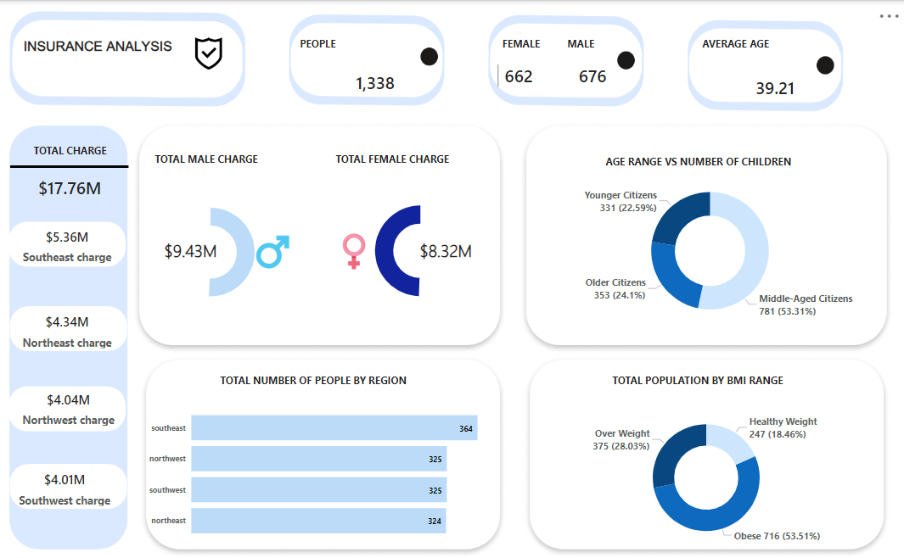

# Insurance

## Insurance Analysis

---

## Introduction

Insurance is a means of protection from financial loss in which, in exchange for a fee, a party agrees to compensate another party in the event of a certain loss, damage, or injury. It is a form of risk management, primarily used to hedge against the risk of a contingent or uncertain loss.

## Problem Statement

1. What is the gender distribution like? And how has the total charges being influenced by this?

2. What is the age range distribution? And those this dsitribution have children and if so does it affect the charges?

3. Are the population healthy or not?

4. What region has the most number of people and what has being the total charg so far?

## Data Cleaning

This is a dummy dataset. and the data consists of just one table with 7 columns and over 1,000 rows. I created new columns(age range and bmi range) using conditional columns in the power query. The data was clean hence there was no need to replace values or any other form of cleaning.
A table for measures was created, with functions like SUM, AVERAGE and CALCULATE being used.

## Data Visualization

The visualization is a one page dashboard. You can interact with the visualization here.https://app.powerbi.com/view?r=eyJrIjoiZmRjMWE4MDEtZmFmYi00NGJjLWE3OWItNDYwZTkyOThiNmExIiwidCI6ImUyODE5OGNhLTExOWQtNDhmOC1iYzBlLTczMzIxYTM4YzJlMyJ9

## Insurance dashboard

---

## Insights

1.	The total number of people was 1,338. And the male distribution was 676 while that of the female was 662.

2.	The average age for this population was 39.21. with the least age being 18 and the maximum age being 64.

3.	The total charge that has been generated from this population was 17.76 million dollars. With the male total charge being the highest with 9.43 million dollars as compared to the female total charge being 8.32 million dollars.

4.	Middle aged citizens were 536 within the range(<=49), the younger citizens were 417 within the range(<=29) and the older citizens were 385 within the range(<=64).

5.	A larger percent of the population was obese with 53.51% within the range (<=54), overweight citizens were 28.03% within the range(<=29.9) and 18.46% being healthy within the range(<=25). Which ultimately means the life insurance paid by the obese and overweight citizens would be lower due to them facing health challenges because of their health.

6.	Southeast region had the highest number of people, and it also topped the chart as the area with the most charges accumulated which was 5.36 million dollars and the least was southwest region with being the third populated region, it managed to be the least region in terms of charges accumulated which is 4.01 million dollars.

---

